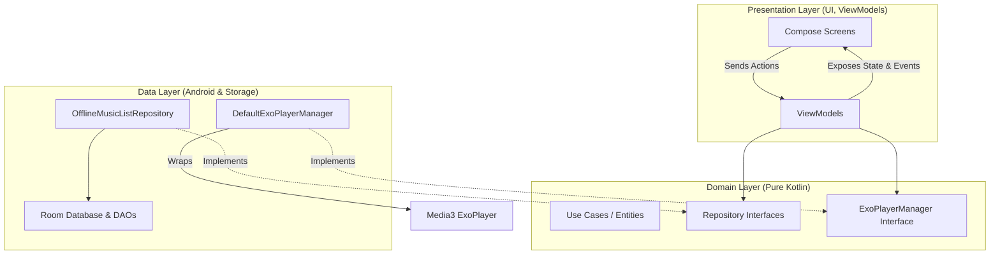

# 🎵 VibePlayer - Modern Offline Android Music Player

[](https://kotlinlang.org/)
[](https://developer.android.com/jetpack/compose)
[](https://developer.android.com/topic/architecture)
[](https://insert-koin.io/)
[](LICENSE)

🌐 **Read this in other languages:**
*   [繁體中文 (Traditional Chinese)](README.zh-TW.md)

---

VibePlayer is a modern, premium offline music player for Android designed to showcase modern Android development best practices. Built from the ground up using **Clean Architecture**, **MVI (Model-View-Intent)**, **Jetpack Compose (Material 3)**, **Media3 ExoPlayer**, and **Room Database**, this project offers a seamless, feature-rich listening experience with high code maintainability and testability.

> [!IMPORTANT]
> This application was built as a capstone project for the **Mobile Dev Campus**, demonstrating a production-ready offline audio scanning, querying, caching, and playback architecture.

---

## 📸 Screenshots

| 🎵 All Songs | 📂 Playlist Options | ➕ Add Songs to Playlist |
| :---: | :---: | :---: |
|  |  |  |

| 📂 Playlist Detail | 🎧 Fullscreen Player |
| :---: | :---: |
|  |  |

---

## ✨ Features

*   🔍 **Smart Local Audio Indexing & Filtering**
    *   Scans the Android MediaStore content provider for local audio files.
    *   Filters indexing dynamically based on size and duration thresholds to exclude short voice memos, notifications, or call recordings.
    *   Engages users during scans with a highly polished circular **radar scanning animation (`RadarScanningView`)**.
*   📂 **Robust Playlist Management**
    *   Allows creating, editing, renaming, and deleting playlists.
    *   Maintains track associations dynamically using many-to-many relationship mapping in Room database.
*   🎧 **Seamless Media3 ExoPlayer Playback**
    *   Direct Media3 ExoPlayer wrapper supporting reliable playback, seeking, pausing, and skipping.
    *   Features loop, single-track repeat, and timeline-level random shuffling.
    *   Implements native Android **"Audio Becoming Noisy"** listeners to auto-pause when headphones or Bluetooth connections are severed.
*   🎨 **Modern Glassmorphic UI/UX**
    *   Fully developed in **Material 3 Jetpack Compose**.
    *   Includes soft glassmorphic visual blurs, dynamic artwork color fading, spinning vinyl turntable visualizers, and a floating persistent bottom player (`MiniPlayer`) drawer.
*   🚀 **Fuzzy Matching Local Search**
    *   Instantly queries the database to filter track lists in real-time by title, artist, or metadata.

---

## 🛠 Tech Stack

*   **UI/Presentation**:
    *   **Jetpack Compose**: Modern declarative layout system.
    *   **Coil 3**: Efficient asynchronous image loading and memory caching for local music covers.
    *   **Navigation Compose**: Strictly **Type-Safe navigation** utilizing Kotlin Serialization.
*   **State Control & Dependency Injection**:
    *   **MVI (Model-View-Intent)**: Ensures a single source of truth for UI states.
    *   **Koin**: Lightweight, compile-time safe, and highly flexible Dependency Injection.
*   **Data & Storage Core**:
    *   **Room Database**: Local SQL storage mapping track index caches, playlists, and cross-references.
    *   **Media3 ExoPlayer**: Production-grade Google media playback framework.
    *   **Accompanist Permissions**: Clean declarative dynamic runtime permission request system.

---

## 🏗 Architecture & Design Patterns

The project is structured according to **Clean Architecture** to maintain clean boundaries between UI, business rules, and low-level storage frameworks:



### 1. Presentation Layer (MVI Pattern)
- **State, Action, UiEvent**: Views observe a single immutable state Flow. Views trigger actions (`Action`) to the ViewModel, which returns single-shot UI events (like `UiEvent.OnAddToPlaylistSucceed` for SnackBars) or updates state.
- **Shared Player State**: The `MusicSharedViewModel` is tied to the Activity context, letting the bottom bar player and the full-screen player access the exact same queue, seek states, and play status without tedious event bus code.

### 2. Domain Layer
- Written in **pure Kotlin** with no dependencies on Android SDK classes, ensuring core music playback policies remain 100% unit-testable. Contains business entities (`Audio`, `Playlist`) and contracts.

### 3. Data Layer
- **Room Cache Architecture**:
  - `AudioEntity` represents local track caches.
  - `PlaylistEntity` stores custom playlists.
  - `PlaylistAudioEntityCrossRef` serves as the many-to-many relationship mapping database table.
- **Player Core**: `DefaultExoPlayerManager` implements `ExoPlayerManager` from the domain, controlling standard repeat configurations and calculating shuffle order maps on ExoPlayer timelines.

---

## 📂 Project Directory Structure

```
com.lihan.vibeplayer
│
├── core                  # Common infrastructure
│   ├── database          # Room database, DAO layers, and TypeConverters
│   ├── di                # App-level Dependency Injection setup (CoreModule)
│   ├── navigation        # Serializable Route class declarations and BottomBar display filters
│   └── presentation      # Reusable views (RadarScanningView, CircleIconButton, UiText)
│
├── ui                    # Visual foundation and customization
│   ├── design_system     # VPFloatingActionButton, VPCheckbox, VPSurface
│   └── theme             # Theme configuration, palettes, and typography
│
├── music_list            # Core Music Feature
│   ├── data              # Repository implementations and ExoPlayerManager controls
│   ├── domain            # Pure business entities (Audio, Playlist)
│   └── presentation      # Playback states, ViewModels, and Compose layouts
│       ├── components    # FullScreenPlayer, MiniPlayer, PlaylistBottomSheet, SongCard
│       └── songs/playlist# SongsPage and PlaylistPage pager tabs
│
├── scan                  # Storage directories audio scanning with threshold filters
├── search                # Live query fuzzy-search for tracks and metadata
└── permission            # Runtime permissions request screens with friendly guide UI
```

---

## 🚀 Setup & Installation

### Prerequisite System Requirements
*   Android Studio Jellyfish | 2024.1.1 or higher
*   JDK 17
*   Android 8.0 (API Level 26) or higher physical device/emulator with storage support.

### Setup Instructions
1.  **Clone the project**:
    ```bash
    git clone https://github.com/encorex32268/VibePlayer.git
    ```
2.  Import the project folder in Android Studio and wait for Gradle synchronization.
3.  Execute **Run** (`Ctrl+R` or click run button) to compile and deploy.
4.  Accept the runtime media/audio permissions on first launch and enjoy your offline library!

---

## 🗺 Future Roadmap

- [ ] **Background Playback & MediaSession integration**
  * Fully bind `MediaSessionService` to let audio stream uninterruptedly when screen is locked or app is in background, adding interactive controls on Android notifications.
- [ ] **Material You (Dynamic Coloring)**
  * Automatically adapt the layout visual palette using Android 12+ wallpaper dynamic color generation.
- [ ] **Android Auto Support**
  * Implement official Android Auto vehicle media templates for safer listening experience on the road.
- [ ] **Automated Testing Suites**
  * Integrate comprehensive unit tests for Room database DAOs and Compose UI automation testing for the player screen.

---

## 📜 License

This project is licensed under the MIT License - see the [LICENSE](LICENSE) file for details.

---

**Author**: [LiHan](https://github.com/encorex32268)  
**Project Link**: [VibePlayer on GitHub](https://github.com/encorex32268/VibePlayer)
