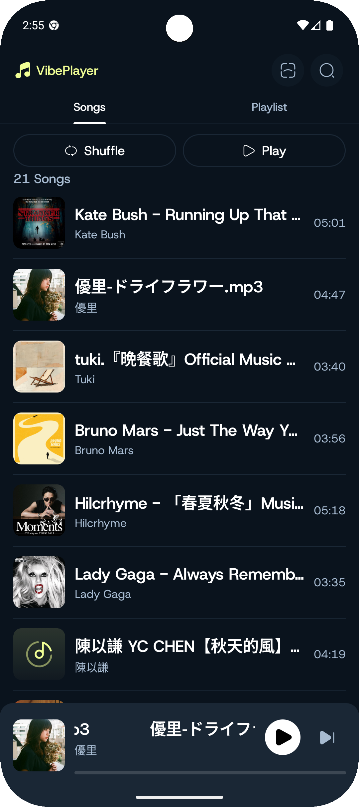
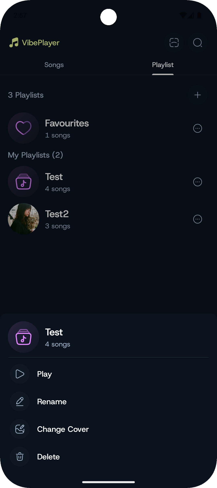
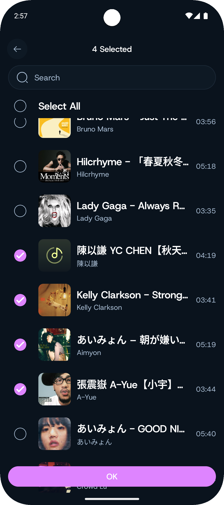
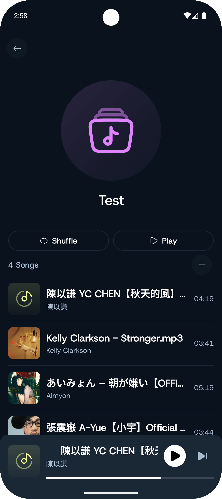
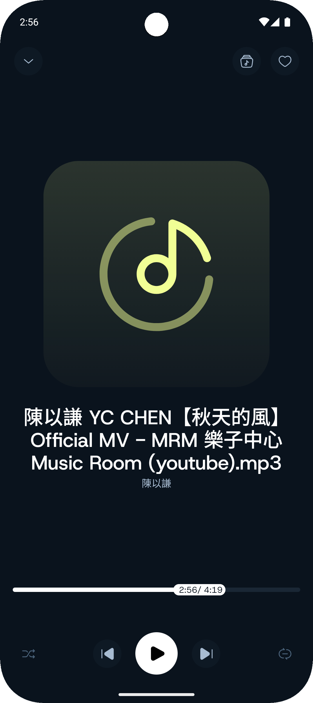
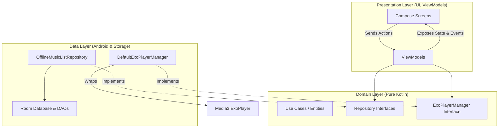

# 🎵 VibePlayer - 現代化 Android 本機音樂播放器

[](https://kotlinlang.org/)
[](https://developer.android.com/jetpack/compose)
[](https://developer.android.com/topic/architecture)
[](https://insert-koin.io/)
[](LICENSE)

🌐 **其他語言版本：**
*   [English (英文)](README.md)

---

**VibePlayer** 是一款專為 Android 設計的現代化、功能豐富的本機音樂播放器。本專案採用當前 Android 社群最推薦的 **Clean Architecture** 與 **MVI (Model-View-Intent)** 架構開發，並完全使用 **Jetpack Compose (Material 3)** 打造精美的極簡視覺介面。

本專案旨在展示現代 Android 開發的最佳實作。透過將業界標準的架構與流暢的音訊控制相結合，VibePlayer 提供了一套具備高擴充性、高測試性的健全本機音樂播放系統。

> [!IMPORTANT]
> 此應用程式是為 **Mobile Dev Campus** 實戰開發，展示了生產級的本機音訊掃描、查詢、快取與播放核心架構。

---

## 🎨 介面預覽 (Screenshots)

| 🎵 歌曲列表 (All Songs) | 📂 播放清單選項 (Playlist Options) | ➕ 新增歌曲至播放清單 |
| :---: | :---: | :---: |
|  |  |  |

| 📂 播放清單詳情 (Playlist Detail) | 🎧 全螢幕播放器 (Fullscreen Player) |
| :---: | :---: |
|  |  |

---

## ✨ 核心功能

*   🔍 **智慧掃描本機音訊 (Local Audio Sync & Scan)**
    *   自動掃描裝置中的本機 `MediaStore` 音訊索引，並支援透過檔案大小與時長動態篩選，有效排除語音訊息或系統提示音。
    *   內建精緻的 **雷達掃描動畫 (`RadarScanningView`)** 以提升掃描時的互動體驗。
*   📂 **動態播放清單管理 (Smart Playlists)**
    *   支援建立、編輯、命名與刪除自訂播放清單。
    *   利用 Room 資料庫的多對多 (Many-to-Many) 關係對照表，動態維護播放清單與曲目關聯。
*   🎧 **流暢的 Media3 ExoPlayer 播放體驗**
    *   直接封裝 Media3 ExoPlayer，提供可靠的播放、跳轉、暫停與切歌控制。
    *   支援單曲循環、列表循環、以及基於 ExoPlayer 時間軸 (Timeline) 的隨機播放 (Shuffle)。
    *   實作 Android 原生 **「音訊裝置拔除 (Audio Becoming Noisy)」** 廣播監聽，在耳機斷開或藍牙中斷時自動暫停播放。
*   🎨 **高質感現代毛玻璃 UI/UX**
    *   完全採用 **Jetpack Compose Material 3** 與自訂的 **Design System** (如 `VPFloatingActionButton`, `VPCheckbox`, `VPSurface`)。
    *   高質感的毛玻璃模糊背景、動態唱盤旋轉動畫與底部迷你播放器 (`MiniPlayer`) 抽屜式切換。
*   🚀 **動態即時模糊搜尋**
    *   支援即時對本機歌曲庫進行歌曲名稱、歌手等欄位的資料庫快速模糊檢索。

---

## 🛠 技術棧與開源庫

*   **呈現層 (Presentation Layer)**:
    *   **Jetpack Compose**: 宣告式 UI 排版系統。
    *   **Coil 3**: 高效的本機音樂封面異步載入與記憶體快取。
    *   **Navigation Compose**: 透過 Kotlin Serialization 實現**型別安全 (Type-Safe)** 的導航與參數傳遞。
*   **控制與狀態 (Control & Domain)**:
    *   **MVI Pattern**: 單向資料流，利用 `State`, `Action`（使用者意圖）與 `UiEvent` 確保 UI 狀態的一致性。
    *   **Koin**: 輕量且靈活的依賴注入 (Dependency Injection) 框架。
*   **資料與核心 (Data & Core)**:
    *   **Room Database**: 高效 SQL 本機快取，快取歌曲資訊與多對多播放清單關係。
    *   **Media3 ExoPlayer**: 生產級的 Google 音訊播放核心框架。
    *   **Accompanist Permissions**: 宣告式的系統儲存權限動態請求與管理。

---

## 🏗 架構設計 (Clean Architecture & MVI)

本專案嚴格遵循**乾淨架構 (Clean Architecture)** 原則，將模組劃分為 Presentation、Domain、Data 三層，實現高度的解耦與單元測試便利性：



### 1. Presentation Layer (呈現層)
*   **MVI 設計**：每個畫面都有專屬的 `State`（畫面狀態）、`Action`（使用者意圖）與 `UiEvent`（單次事件如顯示 SnackBar）。
*   **Shared ViewModel**：利用 `MusicSharedViewModel` 共享全域播放狀態（如目前播放歌曲、暫停/播放、佇列、進度），讓底部播放控制列 (`PlayerBottomBar`) 與全螢幕播放器 (`FullScreenPlayer`) 達到完美的狀態同步。

### 2. Domain Layer (領域層)
*   **純 Kotlin 實作**，無 Android 依賴。定義了核心實體（`Audio`, `Playlist`）以及 `MusicListRepository`、`ExoPlayerManager` 的抽象介面，方便對業務邏輯進行 100% 獨立單元測試。

### 3. Data Layer (資料層)
*   **Room 快取設計**：
    *   `AudioEntity`：儲存已掃描到的音訊資訊與喜愛狀態。
    *   `PlaylistEntity`：儲存播放清單主表。
    *   `PlaylistAudioEntityCrossRef`：實作播放清單與歌曲的多對多 (Many-to-Many) 關聯。
*   **ExoPlayer 控制器**：
    *   `DefaultExoPlayerManager` 負責控制底層的 `ExoPlayer`，提供播放、暫停、滑動跳轉 (`seekTo`)、隨機狀態計算與靜音控制等服務。

---

## 📂 專案結構簡析 (Project Directory Breakdown)

```
com.lihan.vibeplayer
│
├── core                  # 公用底層模組
│   ├── database          # Room Database, Entity 與 DAO 實作
│   ├── di                # Koin 依賴注入全域配置 (CoreModule)
│   ├── navigation        # 型別安全的 Route 定義與 BottomBar 顯示過濾
│   └── presentation      # 通用 UI 元件 (如 RadarScanningView, CircleIconButton, UiText)
│
├── ui                    # 視覺主題與自訂 Design System
│   ├── design_system     # VPFloatingActionButton, VPCheckbox, VPSurface
│   └── theme             # 配色 (Color.kt)、字型 (Type.kt)、主題設定
│
├── music_list            # 音樂清單模組 (核心)
│   ├── data              # 實作 OfflineRepository 與 ExoPlayerManager
│   ├── domain            # 定義 Audio, Playlist 及相關業務介面
│   └── presentation      # 各畫面的 Compose、ViewModel、MVI 狀態定義
│       ├── components    # FullScreenPlayer, MiniPlayer, PlaylistBottomSheet 等元件
│       └── songs/playlist# 分頁呈現邏輯
│
├── scan                  # 音訊掃描模組 (提供依條件本機掃描，伴隨雷達視覺動畫)
├── search                # 搜尋模組 (即時本機歌曲及歌手模糊檢索)
└── permission            # 權限請求畫面 (精美的儲存權限引導介面)
```

---

## 🚀 快速上手與安裝 (Setup & Installation)

### 系統要求
*   Android Studio Jellyfish | 2024.1.1 或更高版本
*   Gradle JDK 17
*   Android 8.0 (API Level 26) 以上裝置/模擬器（本機掃描需要音訊媒體存取權限）

### 安裝步驟
1.  **複製本機專案**：
    ```bash
    git clone https://github.com/encorex32268/VibePlayer.git
    ```
2.  在 Android Studio 中打開專案，等待 Gradle 同步完畢。
3.  點擊 **Run** 部署至您的 Android 實體裝置或模擬器中。
4.  首次啟動請授予「讀取音訊/媒體」權限，隨後即可開始享受離線音樂！

---

## 🚀 未來開發規劃 (Roadmap)

- [ ] **背景播放與通知列整合 (Background Playback & MediaSession)**
  * 整合 `MediaSessionService`，讓音樂在 App 進入背景或螢幕鎖定時仍能持續播放，並在系統通知列提供精美的音樂控制卡片與進度條。
- [ ] **Material You 動態配色 (Dynamic Coloring)**
  * 支援 Android 12+ 的 Dynamic Theme，讓播放介面隨著使用者手機的桌布主色調自動變換配色。
- [ ] **Android Auto 支援**
  * 整合 Android Auto 媒體範本，讓使用者在開車時也能安全地操作播放清單。
- [ ] **更完整的單元測試與 UI 測試**
  * 針對 Room DAO 進行整合測試，並使用 Compose Test Rule 對 `FullScreenPlayer` 的播放/暫停互動進行 UI 自動化測試。

---

## 📜 開源許可協議 (License)

This project is licensed under the MIT License - see the [LICENSE](LICENSE) file for details.

---

**作者 (Author)**: [LiHan](https://github.com/encorex32268)  
**專案連結 (Project)**: [VibePlayer 於 GitHub](https://github.com/encorex32268/VibePlayer)
